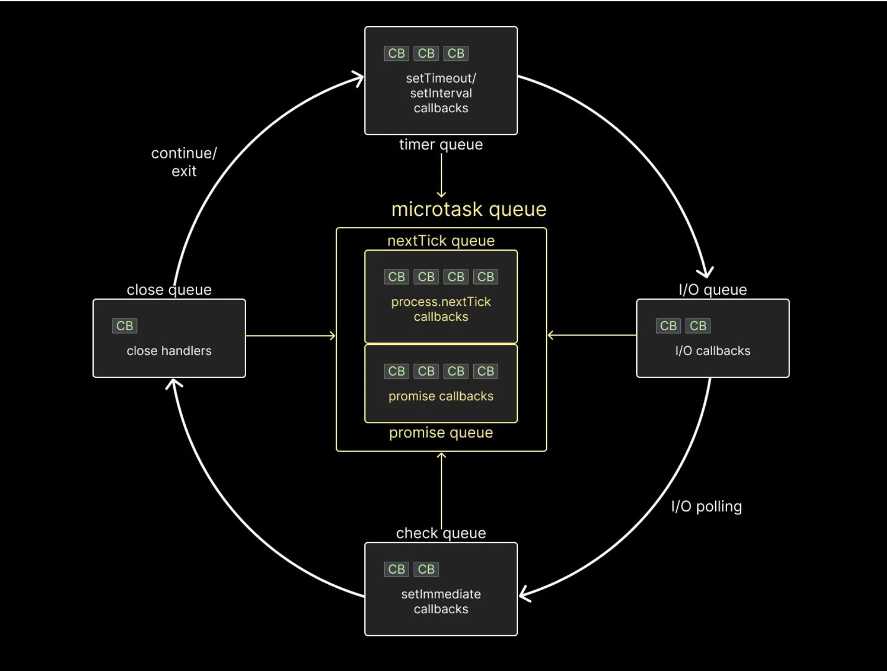

- Process is global object in nodejs
- In modern OS there is alternate of libuv, In windows(IOCP), MACOS(KQUEUE). Firstly asynchronous task will handle by this if they not handle the all then libuv came in the picture then they handle all asynchronous task.

- Whenever we execute an asynchronous method, libuv takes over the execution of the task. Libuv then runs the task using native asynchronous mechanisms of the operating system. In case the native mechanisms are not available or inadequate, it utilizes its thread pool to run the task, ensuring that the main thread is not blocked.

## What is the event loop?
Technically, the event loop is just a C program. But, you can think of it as a design pattern that orchestrates or coordinates the execution of synchronous and asynchronous code in Node.js. The event loop runs continuously as long as your Node.js application is up and running, handling multiple operations executing concurrently



- First, there is the timer queue (technically a min-heap), which holds callbacks associated with setTimeout and setInterval.
- Second, there is the I/O queue which contains callbacks associated with all the async methods such as methods associated with the fs and http modules.
- Third, there is the check queue which holds callbacks associated with the setImmediate function, which is specific to Node.
- Fourth, there is the close queue which holds callbacks associated with the close event of an async task.

***Finally, there is the microtask queue which contains two separate queues.***

- nextTick queue which holds callbacks associated with the process.nextTick function.
- Promise queue which holds callbacks associated with the native Promise in JavaScript.

It is important to note that the timer, I/O, check, and close queues are all part of libuv. The two microtask queues, however, are not part of libuv. Nevertheless, they are still part of the Node runtime and play an important role in the order of execution of callbacks. Speaking of which, let's understand that next.

## Macrotask

### process.nextTick()

`process.nextTick()` is a Node.js method that schedules a callback to run immediately after the current operation completes, but before the event loop moves to the next phase.

---

#### Use
It is used when you want to:
- Run code right after the current function finishes
- Execute logic before any I/O, timers, or promises
- Defer execution without waiting for the event loop phases

---

### How it Works (Short)
1. Current call stack completes
2. Node.js executes all `nextTick` callbacks
3. Event loop continues to timers, I/O, and other phases

`process.nextTick()` has higher priority than:
- `setTimeout()`
- `setImmediate()`
- Promises (`.then()`)

---

### Example
```js
console.log("start");

process.nextTick(() => {
  console.log("nextTick");
});

console.log("end");
